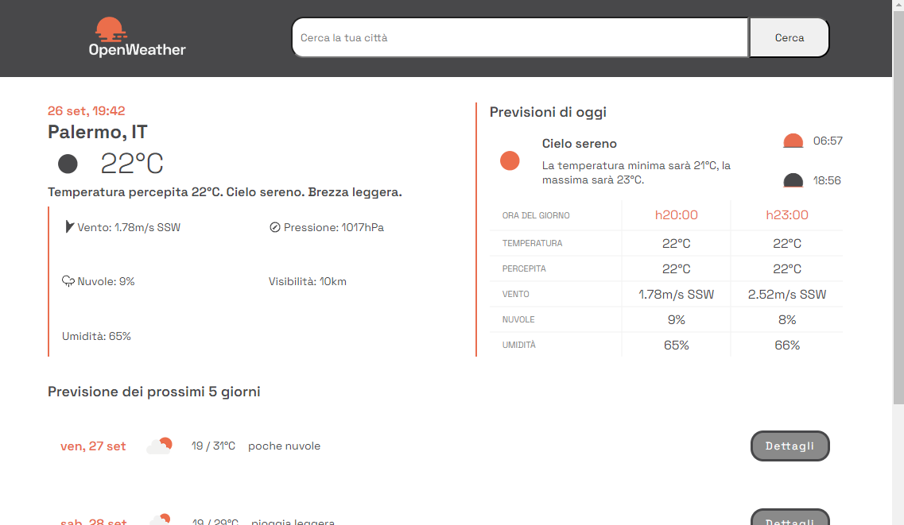

<!-- PROJECT -->

<a id="readme-top"></a>

<div align="center">
 

  <h3 align="center">Open Weather</h3>

  <p align="center">
    The first personal project made during the Frontend - Coding Bootcamp at Edgemony.
  </p>
</div>

<!-- TABLE OF CONTENTS -->
<details>
  <summary>Table of Contents</summary>
  <ol>
    <li>
      <a href="#about-the-project">About The Project</a>
      <ul>
        <li>
            <a href="#built-with">Built With</a>
        </li>
        <li>
            <a href="#system-architecture">System Architecture</a>
        </li>
        <li>
            <a href="#modules">Modules</a>
        </li>
                <li>
            <a href="#data">Data</a>
        </li>
      </ul>
    </li>
    <li>
        <a href="#getting-started">Getting Started</a>
    </li>
    <li>
        <a href="#contacts">Contacts</a>
    </li>
    <li>
        <a href="#license">License</a>
    </li>
        <li>
        <a href="#credits">Credits</a>
    </li>
  </ol>
</details>

<!-- ABOUT THE PROJECT -->

## About The Project

The Weather App is a web application that allows users to search for weather information for different cities. It uses the OpenWeatherMap API to fetch weather data and displays it in the user-friendly OpenWeather interface, to add complexity to the exercise.

### Built With

<div display="flex">
  
    
    
    
</div>

### System Architecture

The project is built using JavaScript, HTML, and CSS. The JavaScript files are organized into modules, each responsible for a specific functionality. The main entry point of the application is the `script.js` file, which imports and initializes the various modules.

#### Modules

- `modules/utilities.js`: This module exports various utility functions that are used throughout the application. It includes functions like `querySel` for selecting elements by CSS selector, `createEl` for creating HTML elements, `addClass` for adding classes to elements, and `getTime` for getting the current time.
- `modules/GET.js`: This module exports functions for making HTTP requests to the OpenWeatherMap API. It includes functions like `GET` for fetching weather data for a specific city and `GETforecast` for fetching forecast data for a city.
- `modules/renderMainData.js`: This module exports functions for rendering the main weather data on the page. It includes functions like `renderHeaderData` for rendering the city name and weather icon, and `getWindDescription` for getting the wind description based on the wind speed.
- `modules/renderCurrentSectionData.js` and `modules/renderForecastData.js`: These modules exports functions for rendering the current weather section and the forecast weather section on the page. They include the functions `renderCurrentSectionData` for rendering the current weather data, `renderForecastData` for rendering the forecast data, `getMinMaxDayTemps` and `getAverageWeather` for getting the minimum and maximum temperatures and the average weather for each day.
- `modules/searchCity.js`: This module exports functions for searching for cities and handling user input. It includes functions like `filterComuniPA` for filtering the list of cities based on user input, `searchCity` for searching for a specific city, and `renderDropdown` for rendering a dropdown menu of filtered cities.
- `modules/handle404Error.js`: This module exports a function for handling errors related to invalid city names. It includes a function called `handle404Error` that displays an error message when a city is not found.

### Data

The application uses the OpenWeatherMap API to fetch weather data.

<p align="right">(<a href="#readme-top">back to top</a>)</p>

<!-- GETTING STARTED -->

## Getting Started

To get a local copy up and running follow these simple example steps.

1. Clone the repository to your local machine
   ```sh
   git clone https://github.com/majinbrum/super-mario-shoes
   ```
2. The application uses the OpenWeatherMap API to fetch weather data. Make sure to replace the placeholder API key stored in the `material/key.js` file with your own API key.
3. Open the `index.html` file in a web browser to view the application or use `Live Server`, open your web browser and navigate to http://localhost:3000.

<p align="right">(<a href="#readme-top">back to top</a>)</p>

<!-- CONTACTS -->

## Contacts

**Bruna Alamia** **-** [@linkedin](https://linkedin.com/in/brunaalamia) **-** brunaalamia@gmail.com

<p align="right">(<a href="#readme-top">back to top</a>)</p>

<!-- LICENSE -->

## License

This project is licensed under the MIT License.

<p>Copyright (c) 2024 Bruna Alamia

Permission is hereby granted, free of charge, to any person
obtaining a copy of this software and associated documentation
files (the "Software"), to deal in the Software without
restriction, including without limitation the rights to use,
copy, modify, merge, publish, distribute, sublicense, and/or sell
copies of the Software, and to permit persons to whom the
Software is furnished to do so, subject to the following
conditions:

The above copyright notice and this permission notice shall be
included in all copies or substantial portions of the Software.

THE SOFTWARE IS PROVIDED "AS IS", WITHOUT WARRANTY OF ANY KIND,
EXPRESS OR IMPLIED, INCLUDING BUT NOT LIMITED TO THE WARRANTIES
OF MERCHANTABILITY, FITNESS FOR A PARTICULAR PURPOSE AND
NONINFRINGEMENT. IN NO EVENT SHALL THE AUTHORS OR COPYRIGHT
HOLDERS BE LIABLE FOR ANY CLAIM, DAMAGES OR OTHER LIABILITY,
WHETHER IN AN ACTION OF CONTRACT, TORT OR OTHERWISE, ARISING
FROM, OUT OF OR IN CONNECTION WITH THE SOFTWARE OR THE USE OR
OTHER DEALINGS IN THE SOFTWARE.</p>

<!-- CREDITS -->

## Credits

- [OpenWeatherMap API](https://openweathermap.org/api): Provides weather data for the application.
- [Google Fonts](https://fonts.google.com/): Used to display the "Space Grotesk" font in the application.
